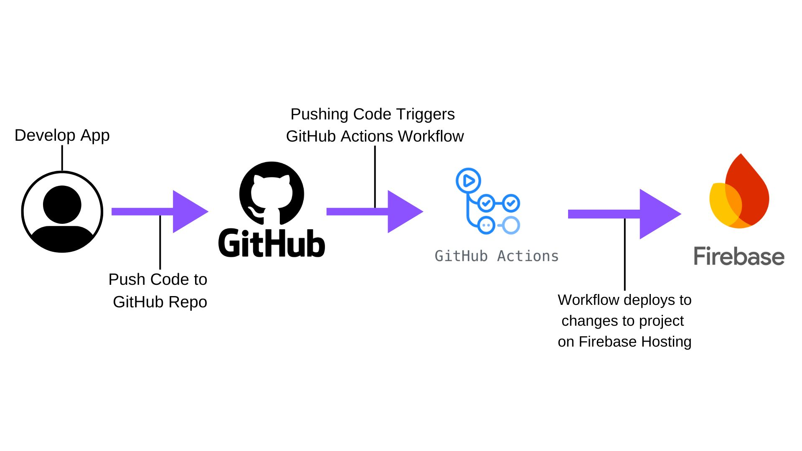

+++
title = 'Continuous Deployment of My Personal Website'
date = 2024-09-13T01:15:58-04:00
draft = false
+++

## Configuring Firebase Hosting with Github Actions for CI/CD

## Why use Continuous Integration / Continuous Deployment (CI/CD)?

I use continuous deployment and integration to streamline the workflows of building this website rapidly. I focus on making quick, incremental changes to the site. These changes can be quickly tested, pushed to the repository, and then automatically be deployed to production.

## Explainging the Techonolgy and Tools:

_Diagram depicting GitHub Actions Workflow to publish changes to code automatically on Firebase_

Google Firebase is Google's "serverless" application platform, which includes a host of features to simplify application development: databases, authentication, and web hosting. I am using Firebase to host this website for free.

Github Actions is a platform for CI/CD that triggers a "workflow" to run after an event occurs. In my case, I trigger a workflow to automatically publish new versions of the site to Firebase Hosting, whenever the "main" git branch is updated.

Thankfully, there is a built in option in Firebase Hosting to generate workflow files for automatic deployment when code is pushed to a specific branch, "main", on GitHub.
